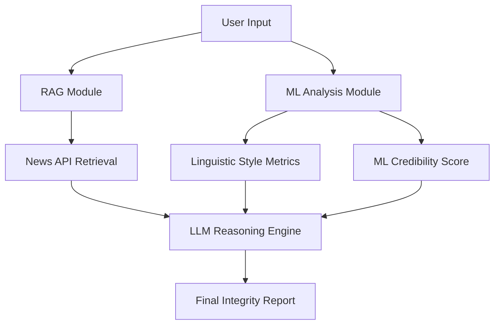

# FakeNewsDetector — Agentic AI News Credibility System

[](https://fakenewsdetector-wb6gzcc5fbimonu7cvgvvu.streamlit.app/)

## 1. Project Overview
**FakeNewsDetector** is a production-level Agentic AI system designed to audit the credibility of news articles. Moving beyond simple binary classification, this system combines traditional Machine Learning, **Retrieval-Augmented Generation (RAG)**, and **Large Language Model (LLM)** reasoning to provide transparent, evidence-grounded veracity assessments.

The project was developed in two major phases:
*   **Milestone 1**: Established the foundational ML pipeline and linguistic style analysis.
*   **Milestone 2**: Integrated real-time evidence retrieval (RAG) and cognitive reasoning (LLM) to create a multi-step Agentic AI pipeline.

---

## 2. System Architecture & Workflow
The system follows an end-to-end pipeline where each article undergoes a three-stage audit:

1.  **Linguistic & statistical Audit (ML)**: Classifies the text using a Logistic Regression model and extracts behavioral "Style DNA" signals.
2.  **Evidence Retrieval (RAG)**: Automatically generates optimized search queries and fetches real-world news articles via the **News API**.
3.  **Cognitive Reasoning (LLM)**: Analyzes the claim against the retrieved evidence using **LLaMA 3.1 (via Groq API)** to produce a logical, human-readable verdict.

### Hybrid Workflow


---

## 3. Milestone 1 — The ML Foundation
Milestone 1 focuses on the internal characteristics of the text.

### Core Components:
*   **Logistic Regression Model**: Trained on the ISOT Fake News Dataset (Kaggle), providing a probability-based score (0–100%).
*   **TF-IDF Vectorization**: Analyzes 20,000 top unigram/bigram features to identify linguistic patterns.
*   **Style DNA Map**: Extracts specific behavioural markers:
    *   **Sensationalism**: Detects inflammatory/dramatic vocabulary.
    *   **Clickbait**: Identifies viral engagement-trap phrasing.
    *   **Exaggeration**: Flags hyperbole and superlative over-usage.
    *   **Visual Emphasis**: Tracks aggressive formatting (CAPS, !, ?).
    *   **Emotional Intensity**: Measures sentiment magnitude using VADER.

---

## 4. Milestone 2 — Agentic AI Enhancements
Milestone 2 adds external validation and reasoning capabilities.

### Key Features:
*   **RAG Evidence Retrieval**: 
    *   Converts natural language claims into optimized keywords for the **News API**.
    *   Implements **dynamic retrieval** (no hardcoded filters) and **automatic fallback retries** if initial searches fail.
*   **Groq/LLaMA 3.1 Reasoning**:
    *   Determines if a claim is *Supported*, *Contradicted*, or *Unclear* based on retrieved articles.
    *   Generates structured explanations grounded in provided evidence.
*   **Composite Confidence Score**:
    *   Calculates a refined confidence metric by combining ML model scores with evidence availability.
*   **Fallback Reasoning**:
    *   Handles cases with no retrieved news by instructing the LLM to reason from general knowledge while communicating uncertainty—preventing hallucinations.

---

## 5. Security & Safety
As a production-ready system, security is built into the architecture:
-   **API Key Protection**: All sensitive keys (News API, Groq) are managed via `.env` files and Streamlit Secrets.
-   **Prompt Injection Defense**: The system prompt is engineered to detect and reject malicious instructions embedded in user queries.
-   **Privacy-First**: Rejects requests involving personal data or private information.

---

## 6. Technical Stack
*   **Frontend**: Streamlit
*   **ML/NLP**: Scikit-Learn, Pandas, NumPy, VADER
*   **RAG/API**: Requests, News API
*   **LLM**: Groq (LLaMA 3.1-8B-Instant)
*   **Environment**: Python-dotenv, Streamlit Secrets

---

## 7. Project Structure
```text
FakeNewsDetector/
├── app.py                # Main Streamlit UI (Root)
├── predict.py            # ML Prediction & Style Metrics logic
├── model.pkl             # Trained Logistic Regression model
├── vectorizer.pkl        # Pre-trained TF-IDF vectorizer
├── requirements.txt      # Project dependencies
├── Milestone1/           # Notebooks and archives for phase 1
└── Milestone2/           # Phase 2 implementation
    ├── rag/              # RAG Evidence Retrieval modules
    ├── agents/           # LLM reasoning and analysis logic
    └── app.py            # Milestone 2 specific UI build
```

---

## 8. Setup & Installation
1.  **Clone the Repository**:
    ```bash
    git clone https://github.com/GEN-NOAA/FakeNewsDetector.git
    cd FakeNewsDetector
    ```
2.  **Install Dependencies**:
    ```bash
    pip install -r requirements.txt
    ```
3.  **Configure Environment**:
    Create a `.env` file in the root directory:
    ```text
    NEWS_API_KEY=your_news_api_key
    GROQ_API_KEY=your_groq_api_key
    ```
4.  **Run the App**:
    ```bash
    streamlit run app.py
    ```

---

## 9. Conclusion
FakeNewsDetector demonstrates a principled approach to modern AI: moving beyond binary "black-box" classification toward **interpretable, evidence-grounded AI agents**. By combining the statistical reliability of ML with the contextual reasoning of LLMs, the system provides a robust tool for combating misinformation in the digital age.

---
### Documentation & Links
*   **Detailed Project Report**: [View Full Report (Milestone 2)](https://docs.google.com/document/d/1eG_hbjXOpaPncHS38r1wUVPsSy1UsUV_uNRKbbPPn80/edit?tab=t.0)
*   **Milestone 1 Deployment**: [Access Here](https://fakenewsdetectorgit-hhwwpb9eqfzjj2uywqqmrw.streamlit.app/)
*   **Dataset Source**: [ISOT Fake News Dataset (Kaggle)](https://www.kaggle.com/datasets/csmalarkodi/isot-fake-news-dataset)
*   **Milestone 2 Deployment**: [Access Here](https://fakenewsdetector-wb6gzcc5fbimonu7cvgvvu.streamlit.app/)
